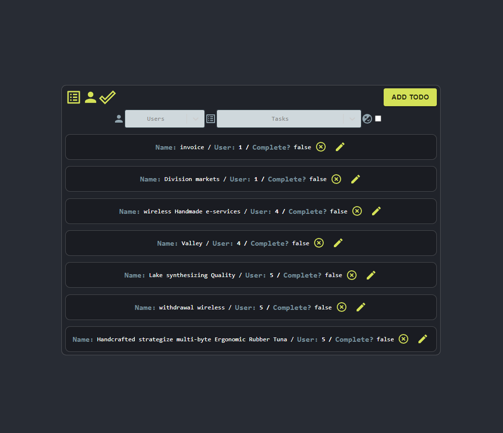

  
  # BlueTodo
  
  ## Table of Contents
  * [Description](#description)
  * [Installation](#installation)
  * [Usage](#usage)
  * [Contributing](#contributing)
  * [Guidelines](#guidelines)
  * [Tests](#tests)
  * [License](#license)
  * [Questions](#questions)
---

  ## Description
  A simple React todo application with full CRUD functionality, utilizing TypeScript and the Mirage package to simulate a back end and test front end requests.

  ## Installation
   Clone the repository, npm install and npm start

  ## Usage
   Simple User Interface

  ## Contributing
   If you'd like to contribute, reach out through the email below.

  ## Guidelines
   None

  ## Tests
   Front end requests tested with Mirage

  ## License
   

   ---

  ## Questions
   For any questions you can find me at [GitHub](https://github.com/mleftwich) or email me at [mleftwich@shiftleft.net.au](mailto:mleftwich@shiftleft.net.au) 
